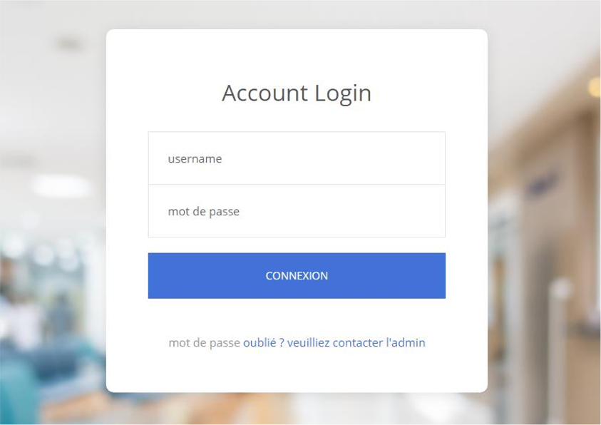
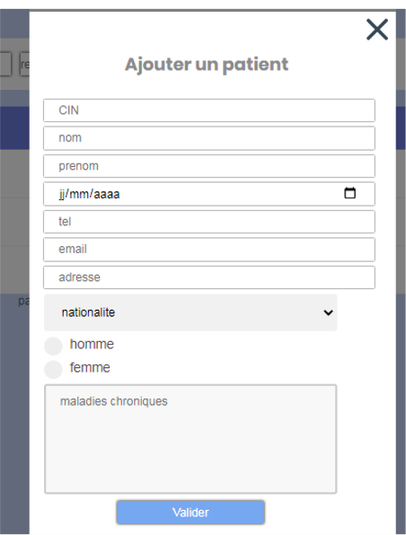
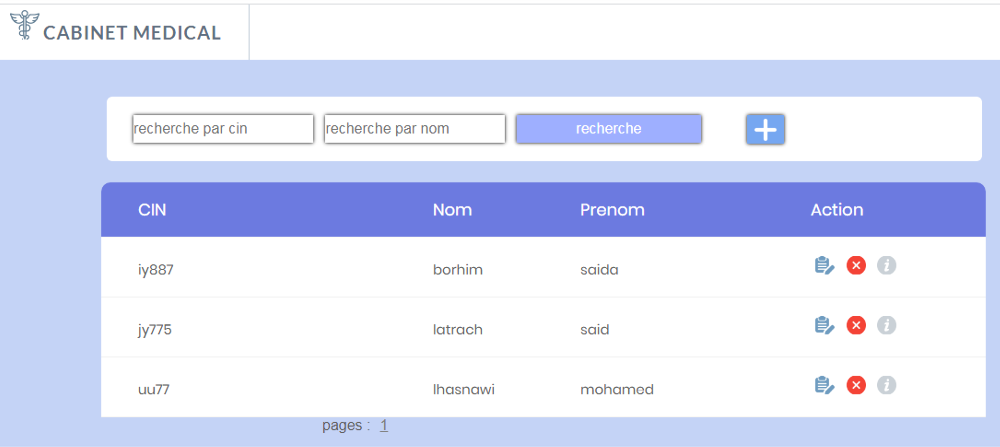
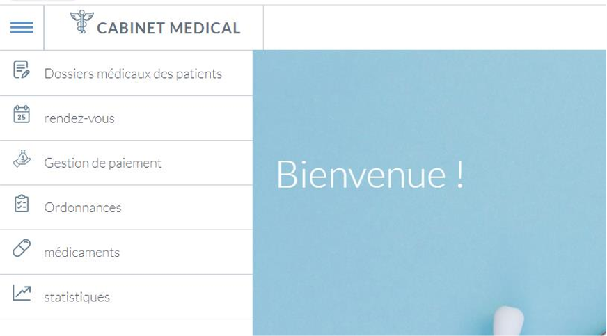
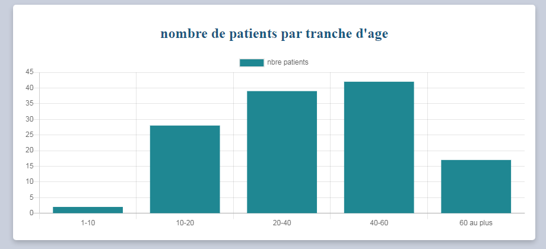
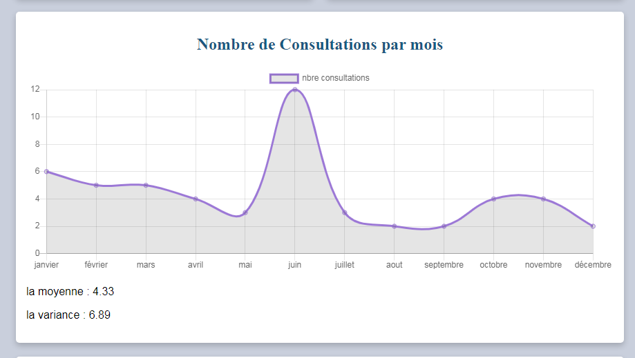
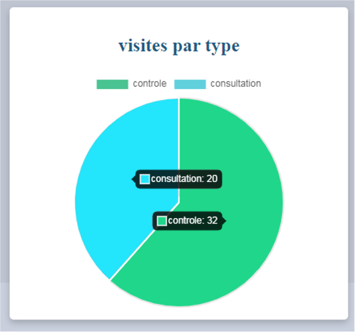
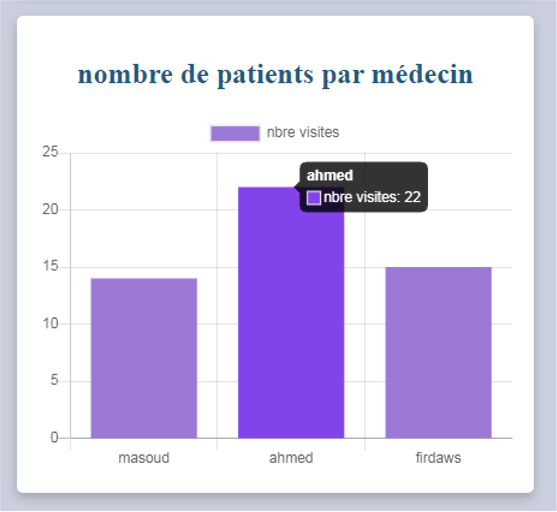

# Clinic Management System

## Overview

This repository contains a **university full-stack web project (2020)** developed to manage the operations of a medical clinic (*cabinet médical*). The system provides secure authentication and role-based access for administrators, assistance staff, and doctors, covering patient records, appointments, payments, analyses, prescriptions, and statistics.

---

## Key Features

### Authentication

* Secure login system
* Role-based access control (Administrator, Assistance, Doctor)

### Administrator

* User management (add, delete, view users)
* Roles: assistance and doctor

### Assistance Account

* Patient medical records management (CRUD)
* Appointment scheduling and management
* Payment management
* Medical analyses management

### Doctor Account

* Prescription management
* Medicine management
* Consultation of patient records
* Consultation of payments and analyses
* Statistical reports

---

## Technologies Used

* **PHP** – backend logic
* **MySQL** – relational database
* **JavaScript** – client-side interactions
* **HTML / CSS** – user interface

---

## Project Structure

This project follows a classic MVC-style organisation with separate layers for:

* Authentication
* Business logic
* Database access
* User interfaces per role

---

## How to Run the Project Locally

1. Install a local server environment (**XAMPP / WAMP / MAMP**)
2. Place the project folder inside the server root 

## User Interfaces

### Authentication Interface

Secure login interface allowing users to authenticate using role-based credentials.

### Add Patient Interface

Interface used by assistance staff to register new patients.

### Patient Medical Records

Interface for consulting and managing patient medical files.

### Doctor Dashboard

Dashboard providing doctors access to prescriptions, medicines, and statistics.

### Statistical Dashboards

Distribution of patients by age range.

Monthly consultation statistics.

Statistical representation of consultations grouped by visit type (consultation or follow-up).

Patient distribution per doctor.

## Academic Context

* Developed as part of a **university coursework project**
* Year: **2020**
* Language of the application and report: **French**

## Licence

This project is provided for **academic and educational purposes only**.
